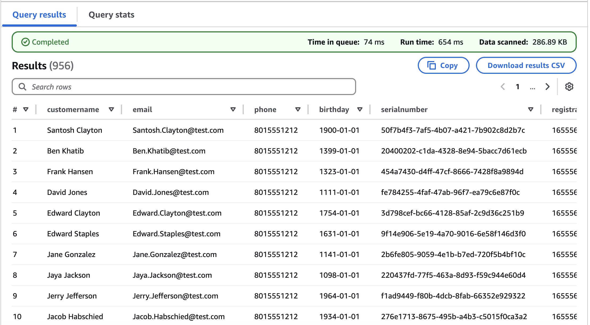
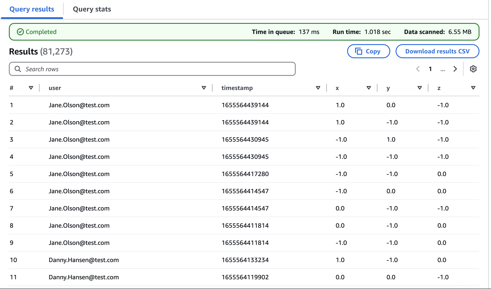
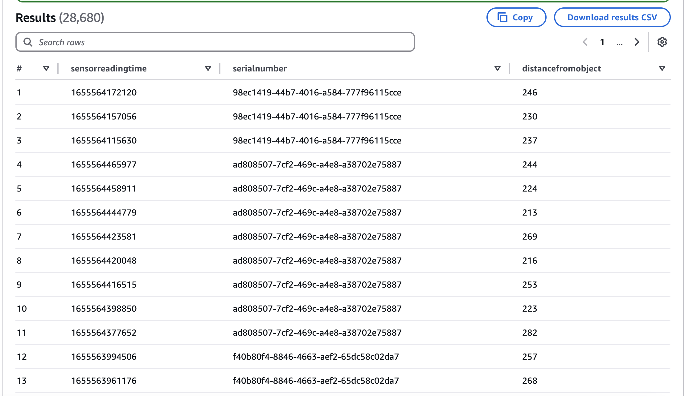
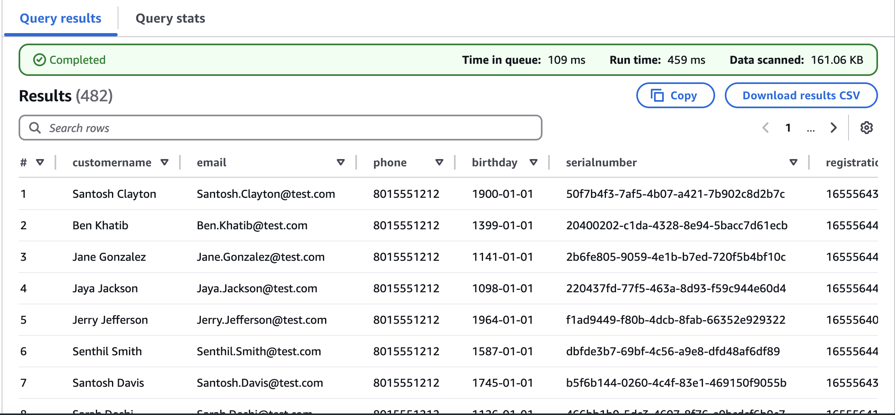
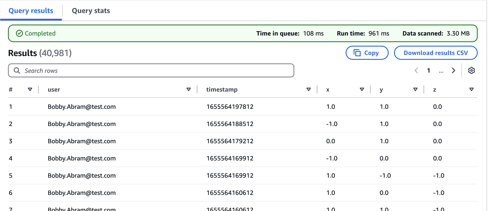
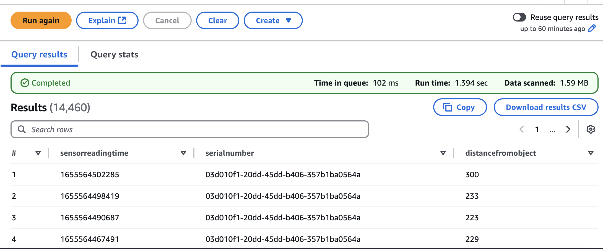
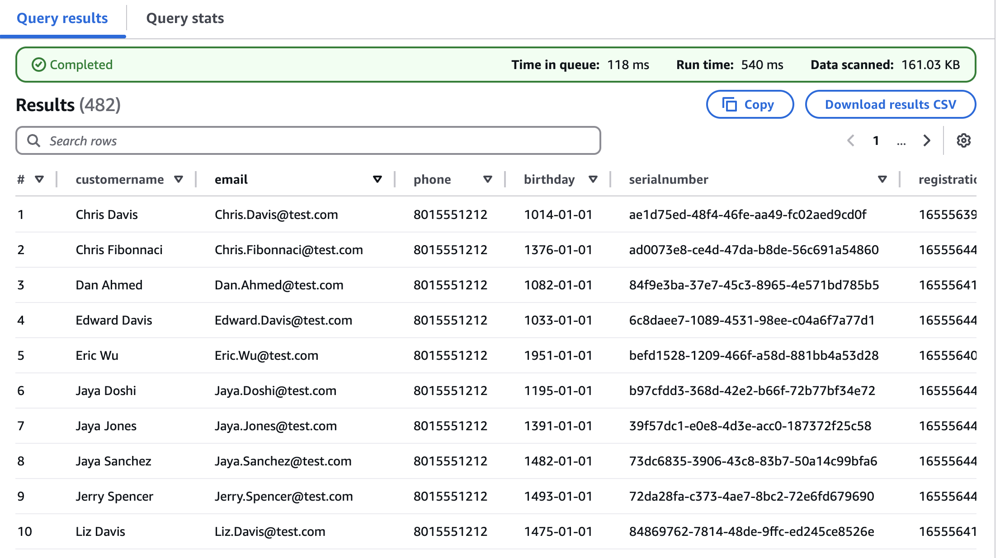
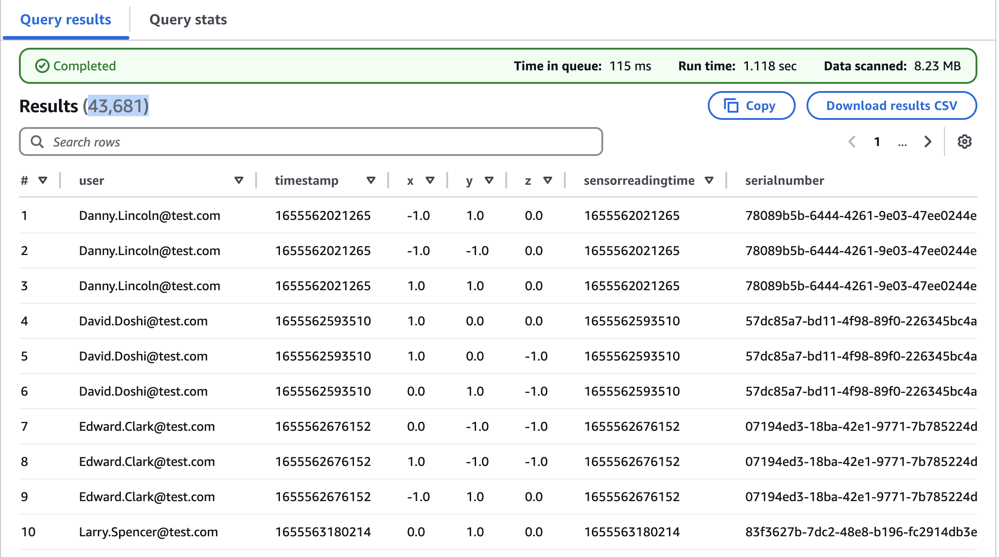
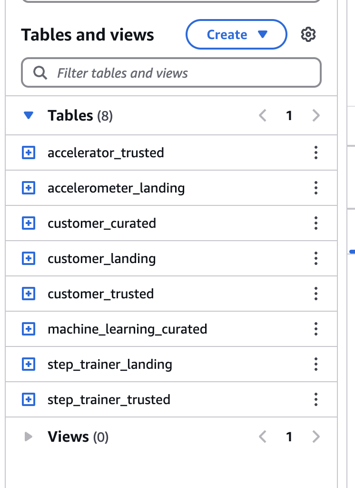

# STEDI Lakehouse ETL Solution

This repository contains an AWS Lakehouse ETL pipeline built using **AWS Glue**, **S3**, **Athena**, **PySpark**, and **SQL** to support data ingestion, transformation, and curation for STEDI's data science initiatives.

---

## Project Structure
```text
project-root/
├── scripts/                  # All Glue job scripts (Python + SQL)
│   ├── customer_landing_to_trusted.py
│   ├── customer_landing.sql
│   ├── customer_trusted_to_curated.py
│   ├── accelerometer_landing_to_trusted.py
│   ├── accelerometer_landing.sql
│   ├── step_trainer_landing_to_trusted.py
│   ├── step_trainer_landing.sql
│   └── machine_learning_curated.py
│
├── images/                  # Screenshots of Glue tables and Athena results
│   ├── customer_landing.png
│   ├── customer_trusted.png
│   ├── customer_curated.png
│   ├── accelerometer_landing.png
│   ├── accelerator_trusted.png
│   ├── step_trainer_landing.png
│   ├── step_trainer_trusted.png
│   ├── machine_learning_curated.png
│   └── all_glue_tables.png
│
└── README.md
```


---

## Overview
This solution simulates and processes STEDI customer, accelerometer, and step trainer IoT data using a multi-zone Lakehouse architecture:

- **Landing Zone**: Raw incoming data from web, mobile, or IoT.
- **Trusted Zone**: Filtered and privacy-compliant data.
- **Curated Zone**: Data that's enriched, joined, and ready for downstream analytics or ML.

---

## Step-by-Step ETL Workflow

### 1. **Create Glue Tables for Landing Zones**

- Scripts: `*.sql` under `/scripts`
- Use AWS Glue Crawler or Athena DDL to define:
  - `customer_landing`
  - `accelerometer_landing`
  - `step_trainer_landing`

**Validation**: Query via Athena. Screenshots:
- 
- 
- 

---

### 2. **Create Trusted Zone Tables with Glue Jobs**

These jobs sanitize the data and store only those records with research consent:

- `customer_landing_to_trusted.py` → `customer_trusted`
- `accelerometer_landing_to_trusted.py` → `accelerometer_trusted`
- `step_trainer_landing_to_trusted.py` → `step_trainer_trusted`

**Validation**:
- 
- 
- 

---

### 3. **Curate Customer Data**

Join `customer_trusted` with `accelerometer_trusted` on user ID to retain only customers who have device data.

- Script: `customer_trusted_to_curated.py`
- Output Table: `customer_curated`

**Validation**:
- 

---

### 4. **Curate Machine Learning Dataset**

Join step trainer readings with accelerometer data based on timestamp and filter only for users in `customer_curated`.

- Script: `machine_learning_curated.py`
- Output Table: `machine_learning_curated`

**Validation**:
- 

---

## Final Table Overview



---

## Tech Stack
- **AWS Glue Studio / Jobs**
- **AWS S3** (Data Lake Zones)
- **Athena** (SQL Queries and Validation)
- **PySpark + Glue API**
- **SQL Transform nodes** (preferred over join nodes)

---

## Notes
- SQL Transform nodes were used over Join/Filter nodes for greater control.
